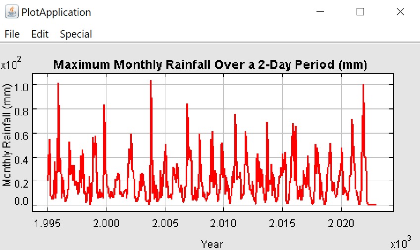

# Insurance-Claims-Forensics
A report for an insurance company to determine if a recent increase in the number of insurance claims made for flood damage in Greater Victoria region are valid.

**Abstract**: 
The purpose of this lab was to determine if a recent increase in the number of insurance claims made for flood damage in the Greater Victoria region are valid. The method being used here is to gather and analyze the past weather precipitation data from Environment Canada and find out months that are most likely to have heavy rainfalls. After finding out the months with most likely rainfall, we can make the judgment of whether the recent increase in insurance claims made for flood damage are valid or not. The statistics and results retrieved from the analysis of data suggests that the recent increase in the number of insurance claims are invalid because April is a month with relatively lower precipitation compared to other months in the year. 

**Introduction**: 
The purpose of this lab was to determine if a recent increase in the number of insurance claims made for flood damage in the Greater Victoria region are valid and analyze when flooding would likely have occurred in the past based on two days of heavy rainfall. By collecting data from Environment Canada, we can make the conclusion of which months have the most heaviest rainfalls based on past data. Weathers and climate usually follow similar patterns over the years so the conclusions being reached can be representative and decisive for the precipitation pattern of this year, which can have an effect on the number of insurance claims. At the same time, precipitation can be one of the major causes for flooding and analyzing precipitation gives insurance companies insights about whether the flooding claims are real or not. 

**Methodology**:  
The weather and precipitation data are collected from the Weather Canada in two of the Victoria stations, university and gonzales. The time range of the precipitation data is taken from 1995 January 1st to 2022 March 9th. The statistics are first read and stored in a java program, and a plot generator tool called Ptolemy is used to support the analysis of the data. Two plots and two tables are generated based on the previous precipitation data. The two plots are “Maximum Monthly Rainfall (mm)” and "Maximum Monthly Rainfall Over a 2-Day Period (mm) ", while the two tables are “Top 10 Monthly Rainfall (mm)" and "Top 10 Maximum Rainfall Over a 2-Day Period (mm)". 

Inside the program, ArrayList<Double[]> data type is used to store the precipitation data. All the yearly precipitation data is stored in the Double array and all the years are then stored in the ArrayList<Double[]>. All the different ArrayList<Double[]> are initialized in the constructor of the class EasyPtPlot, and the plotting of the graph using Ptomeley is done in the main method while the tables are generated in the different methods of the class. When processing the data, the data from the two stations are averaged if both stations have the precipitation data. If none of the stations have data, then a value of -1.0 is assigned to the day without the precipitation data. If only one of the stations has data and the other one does not, then the one that has data would be assigned as the average of two stations. The day with an average value of -1.0 is eventually omitted during the calculation process. 

**Results Retrieved from the Program:** 
 
1, Top 10 Maximum Rainfall Over a 2-Day Period
| Year | Day             | Precipitation |
| ---- |:---------------:| -------------:|
| 2003 | October 16/17   | 104.0mm       |
| 1995 | November 7/8    | 101.4mm       |
| 2021 | November 14/15  | 100.0mm       |
| 2006 | November 5/6    | 84.4mm        |
| 1999 | October 7/8     | 83.7mm        |
| 2010 | December 11/12  | 75.9mm        |
| 2020 | December 21/22  | 71.6mm        |
| 2013 | September 28/29 | 69.3mm        |
| 2015 | November 12/13  | 67.7mm        |
| 2016 | February 14/15  | 66.0mm        |
 
2, Maximum Monthly Rainfall Over a 2-Day Period
 

  

 
2, Top Ten Monthly Rainfall(mm):

| Year | Month       | Precipitation   |
| ---- |:-----------:| ---------------:|
| 2021 | November    | 286.2mm         |
| 2006 | November    | 284.5mm         |
| 1995 | November    | 273.0mm         |
| 1998 | November    | 238.4mm         |
| 2003 | October     | 206.6mm         |
| 2007 | January     | 200.3mm         |
| 2009 | November    | 196.0mm         |
| 2020 | January     | 176.4mm         |
| 2020 | December    | 172.3mm         |
| 1999 | October     | 171.1mm         |
 
4, Maximum Monthly Rainfall 
 

  

**Conclusion:** 
 
Based on the analysis of the precipitation data from 1995 to 2022, it can be reasonably concluded that the recent increase in the number of insurance claims made for flood damage are invalid. This can be suggested by both the plots and the tables as heavy precipitation usually happens in the winter seasons such as October, November, and December, and the month of April does not usually have a heavy amount of precipitation, alluding to the result that these insurance claims made for flood damage are unreasonable and invalid. Even though one of the February months had a heavy rainfall, this result would not have an overall effect on the result generated since the majority of the heavy rainfalls are in the winter months. In general, April, no matter from which layer we are looking at, does not and should not have a heavy rainfall that can cause flooding. 

(Source of Error 1) It must also be stated that precipitation does have a relationship with flood since heavy rainfall does cause floods, but this is not always the case. Other factors besides precipitation can also cause flooding such as overflowing rivers, broken dams, melting snow and ice, or even a lack of vegetation. Thus, it is important to keep in mind that the report can only refute the insurance claims made for floods caused by heavy rain is invalid and unreasonable, and we do not have sufficient evidence to judge other natural disasters that may potentially cause floods as enlisted above. 

(Source of Error 2) Another source of error can be lacking data for several days in the spreadsheet given. Keeping in mind that a number of days are assigned with a value of -1.0 denotes that the day does not have precipitation data. This can be potentially a source of error since we are using data sets that do not have sufficient data to lead to a conclusion. Also, we have only used the precipitation data from 1995 to 2022, and the time range can be a bit brief compared to how much data Environment Canada has. Therefore, a more generalized and persuasive conclusion can be made if we expand the time range of the data. 

(Source of Error 3) We are trying to make predictions for the future based on previous data, and the extrapolation process can be erroneous from time to time. For instance, the ongoing climate change can suggest that our climate is currently undergoing a shift that is different from the past. It is also possible that this year’s climate is radically different from the past, but no one can tell if this is true or not until we have sufficient data for the year of 2022. Overall, we need more precise calculations and data to determine if the insurance claims made from floods are valid or not.

